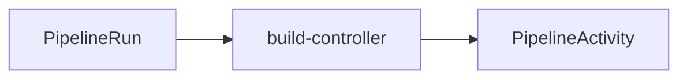
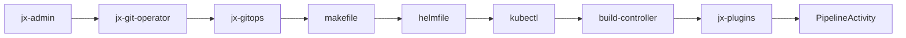

# Problem Statement

Jenkins X is a cloud native CI/CD tool, which uses tekton to create the  Pipeline Activity(pa).

Sometimes the pipeline time-out or cancelled, tekton has a message & status field in the PipelineRun, we have status field but not message field.

# Solution

We would like to have a field, as it would help users understand the current status of each stage. It would make user experience better.

## Components Involved
- jx-admin
- jx-git-operator
- jx-build-controller
- jx-pipeline

## How the boot-job works

